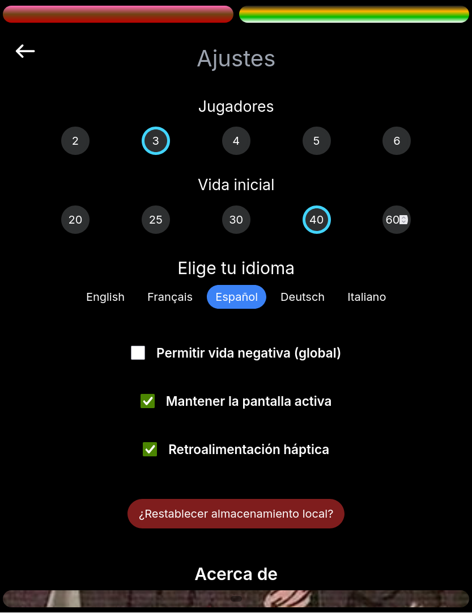
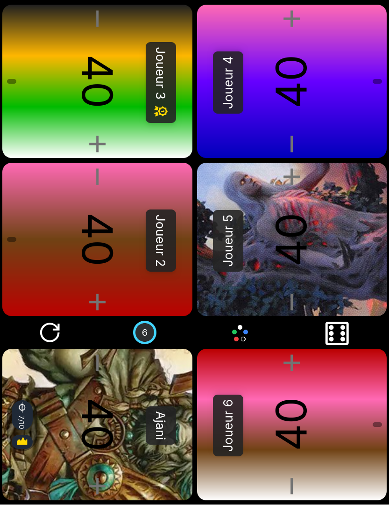
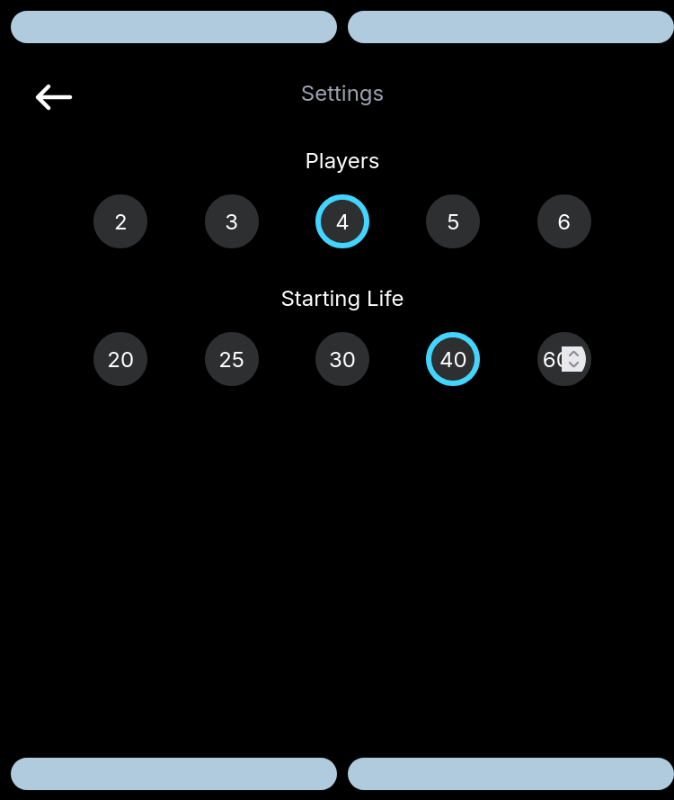
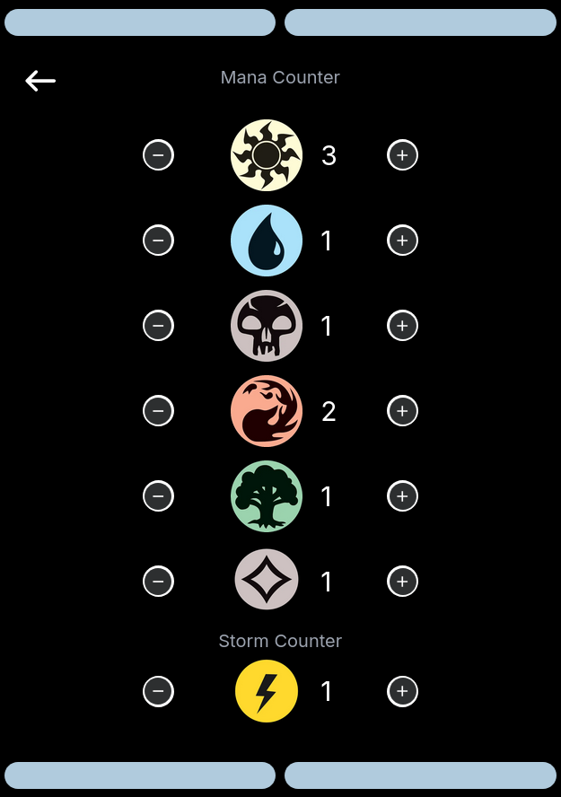
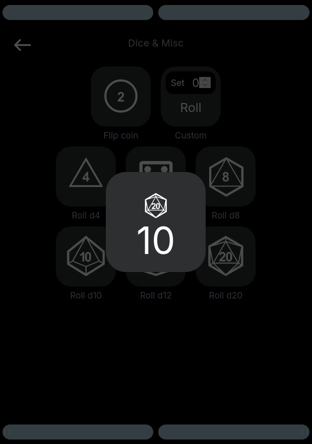

# MTG Life Tracker Clone (alpha version)

A web-based life point tracker for Magic: The Gathering, inspired by the [Lifetap](https://play.google.com/store/apps/details?id=com.lifetap) Android application. Built with SvelteKit, TypeScript, and Tailwind CSS.


**The application can be used on Android or Apple devices, via a simple web browser**, or by downloading the apk file for Android (coming soon!).


You can find it live here: <https://naereen.github.io/My-Android-app-to-track-life-points-at-Magic-the-Gathering/>.
It is updated after every commit I make on the codebase, so you can see the latest changes and improvements there.

> (Backup URL: <https://perso.crans.org/besson/publis/My-Android-app-to-track-life-points-at-Magic-the-Gathering/> but could be not up-to-date)

## 📸 Screenshots





Older screenshots:







---

## Download the Android application (apk)

TODO: finish building and deploying the apk file!

---

## 📋 Prerequisites (to build the app)

Before you begin, ensure you have the following installed:

- **Node.js** (version 18.x or higher recommended)
- **npm** (comes with Node.js) or **pnpm** or **yarn**

To check if you have Node.js installed:

```bash
node --version
npm --version
```

## 🚀 Getting Started

### 1. Clone the Repository

```bash
git clone https://github.com/Naereen/My-Android-app-to-track-life-points-at-Magic-the-Gathering.git
cd My-Android-app-to-track-life-points-at-Magic-the-Gathering
```

### 2. Install Dependencies

Install all required packages using npm:

```bash
npm install
```

Or with other package managers:

```bash
# Using pnpm
pnpm install

# Using yarn
yarn install
```

### 3. Start Development Server

Run the development server with hot-reload:

```bash
npm run dev
```

The application will be available at `http://localhost:5173` (or another port if 5173 is already in use).

To open the app in your browser automatically:

```bash
npm run dev -- --open
```

## 🔨 Building for Production

Build the application for production deployment:

```bash
npm run build
```

This creates a static build in the `build/` directory that can be deployed to any static hosting service.

### Preview Production Build

After building, you can preview the production build locally:

```bash
npm run preview
```

## 📦 Available Scripts

- **`npm run dev`** - Start development server with hot-reload
- **`npm run build`** - Build the application for production
- **`npm run preview`** - Preview the production build locally
- **`npm run check`** - Run type checking with svelte-check
- **`npm run check:watch`** - Run type checking in watch mode
- **`npm run test`** - Run tests with Vitest
- **`npm run lint`** - Check code formatting and run ESLint
- **`npm run format`** - Format code with Prettier

## 🌐 Deployment Options

This project uses `@sveltejs/adapter-static` to generate a static site that can be deployed to various hosting platforms.

### Option 1: Deploy to Vercel

Vercel is the recommended platform for SvelteKit applications:

1. **Install Vercel CLI** (optional):

   ```bash
   npm install -g vercel
   ```

2. **Deploy using Vercel CLI**:

   ```bash
   vercel
   ```

3. **Or connect via Vercel Dashboard**:
   - Go to [vercel.com](https://vercel.com)
   - Import your GitHub repository
   - Vercel will automatically detect SvelteKit and configure the build settings
   - Click "Deploy"

**Build Settings for Vercel:**

- **Build Command:** `npm run build`
- **Output Directory:** `build`
- **Install Command:** `npm install`

### Option 2: Deploy to GitHub Pages

1. **Build the project**:

   ```bash
   npm run build
   ```

2. **Configure GitHub Pages**:

   - Go to your repository settings on GitHub
   - Navigate to "Pages" section
   - Select "Deploy from a branch"
   - Choose the branch containing your `build/` directory

3. **Option A - Use GitHub Actions** (Recommended):

   Create `.github/workflows/deploy.yml`:

   ```yaml
   name: Deploy to GitHub Pages

   on:
     push:
       branches: ['main']
     workflow_dispatch:

   permissions:
     contents: read
     pages: write
     id-token: write

   jobs:
     build:
       runs-on: ubuntu-latest
       steps:
         - uses: actions/checkout@v4
         - uses: actions/setup-node@v4
           with:
             node-version: 18
             cache: 'npm'
         - run: npm ci
         - run: npm run build
         - uses: actions/upload-pages-artifact@v2
           with:
             path: 'build/'

     deploy:
       needs: build
       runs-on: ubuntu-latest
       environment:
         name: github-pages
         url: ${{ steps.deployment.outputs.page_url }}
       steps:
         - uses: actions/deploy-pages@v2
           id: deployment
   ```

4. **Option B - Manual deployment**:

   ```bash
   # Build the project
   npm run build

   # Push the build directory to gh-pages branch
   git subtree push --prefix build origin gh-pages
   ```

### Option 3: Deploy to Netlify

1. **Using Netlify CLI**:

   ```bash
   npm install -g netlify-cli
   netlify deploy --prod
   ```

2. **Using Netlify Dashboard**:
   - Go to [netlify.com](https://netlify.com)
   - Import your GitHub repository
   - Configure build settings:
     - **Build command:** `npm run build`
     - **Publish directory:** `build`

### Option 4: Other Static Hosting Services

The `build/` directory contains a static site that can be deployed to any static hosting service:

- **Cloudflare Pages**: Connect your repository and set build output to `build/`
- **AWS S3 + CloudFront**: Upload the `build/` directory to an S3 bucket
- **Firebase Hosting**: Use `firebase deploy` with the `build/` directory
- **Any web server**: Simply upload the contents of `build/` to your server's web root

## 📁 Project Structure

```
.
├── src/
│   ├── lib/              # Reusable components and utilities
│   ├── routes/           # SvelteKit routes (pages)
│   │   ├── +page.svelte  # Home page
│   │   └── +layout.svelte # Layout wrapper
│   ├── app.html          # HTML template
│   └── app.css           # Global styles
├── static/               # Static assets (images, fonts, etc.)
├── build/                # Production build output (generated)
├── package.json          # Dependencies and scripts
├── svelte.config.js      # SvelteKit configuration
├── vite.config.ts        # Vite configuration
├── tailwind.config.js    # Tailwind CSS configuration
└── tsconfig.json         # TypeScript configuration
```

## 🛠️ Technology Stack

- **[SvelteKit](https://kit.svelte.dev/)** - Web framework
- **[Svelte](https://svelte.dev/)** - UI framework
- **[TypeScript](https://www.typescriptlang.org/)** - Type safety
- **[Tailwind CSS](https://tailwindcss.com/)** - Utility-first CSS framework
- **[Vite](https://vitejs.dev/)** - Build tool and dev server
- **[Vitest](https://vitest.dev/)** - Testing framework

## 🧪 Development

### Type Checking

Run TypeScript type checking:

```bash
npm run check
```

Or in watch mode:

```bash
npm run check:watch
```

### Linting and Formatting

Check code style:

```bash
npm run lint
```

Auto-format code:

```bash
npm run format
```

### Testing

Run tests:

```bash
npm run test
```

---

## 🤝 Contributing

Contributions are welcome! Feel free to:

- Report bugs
- Suggest new features
- Submit pull requests

## ✏️ Authors

**Hacked with ❤️ by [@Naereen](https://github.com/Naereen) in France**
**Initial work by [GuessImNick](https://github.com/GuessImNick)**
**Huge inspiration from [Lifetap](https://play.google.com/store/apps/details?id=com.lifetap) by Mike Bourkas**

## 📋 TODO / Feature Ideas

See the [TODO-ROADMAP.md](./TODO-ROADMAP.md) file for a list of planned features and improvements.

## 📝 [License](./LICENSE)

This project is open source and available for personal use: MIT Licensed.

## 🙏 Acknowledgments

Inspired by the [Lifetap](https://play.google.com/store/apps/details?id=com.lifetap) Android application.
